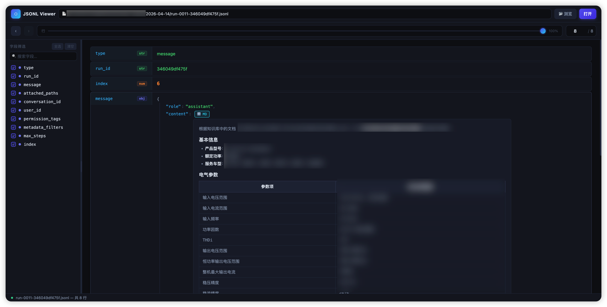

# JSONL Viewer

一个面向非技术用户的本地 JSONL 文件可视化工具，基于 Python 标准库，无需安装任何依赖。



## 快速开始

先安装成全局命令：

```bash
python3 -m pip install -e .
```

安装完成后，在任何目录都可以直接运行：

```bash
jsonlv
```

浏览器会自动打开。也可以直接指定文件：

```bash
jsonlv /path/to/file.jsonl
```

指定首选端口：

```bash
jsonlv --port 8080
```

如果首选端口已被占用，程序会自动切换到一个空闲端口并打印实际地址。

不自动打开浏览器：

```bash
jsonlv --no-open
```

如果你还没安装，也可以在仓库目录里直接运行：

```bash
python3 viewer.py
```

## 功能

**打开文件**
- 点击「浏览」按钮选择文件（macOS 原生对话框）
- 在路径栏输入文件路径后回车或点「打开」
- 直接拖放 `.jsonl` 文件到页面

**行导航**
- 拖动滑块浏览行（0.3 秒延迟防抖）
- 直接在行号框输入数字跳转
- 点击 `‹` `›` 按钮或键盘 `←` `→` 逐行翻页

**字段筛选**（左侧面板）
- 自动提取每行 JSON 对象的字段名
- 勾选/取消勾选控制右侧展示哪些字段
- 支持搜索字段名
- 拖动分隔条调整左右面板宽度

**内容渲染**
- JSON 对象 → 带颜色的可折叠树形结构（key/value 不同颜色）
- 字符串中的嵌套 JSON → 自动识别并展开为树视图
- Markdown 字符串 → 自动渲染（标题、加粗、列表、表格、代码块等）
- 可随时点按钮切换「渲染视图 / 原始字符串」

## 环境要求

- Python 3.7+
- macOS（浏览按钮依赖 osascript；其他系统可用路径输入或拖放）
- 网络访问 [cdn.jsdelivr.net](https://cdn.jsdelivr.net)（用于加载 marked.js Markdown 渲染库）
